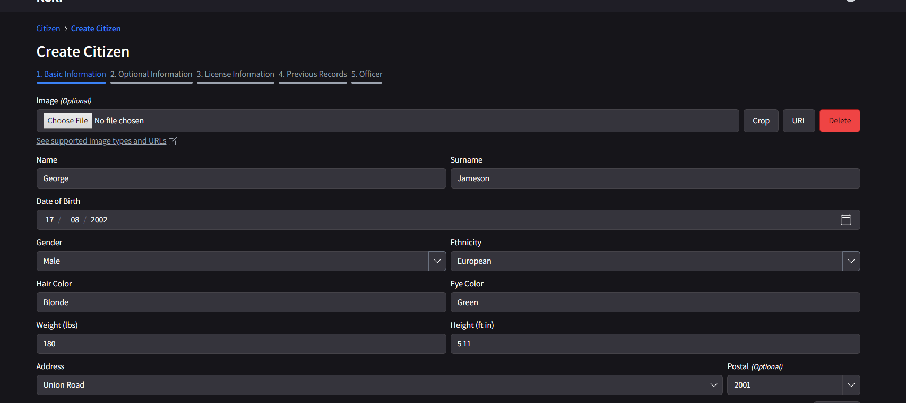

# Registering a Citizen

:::warning This is Required!
It is a requirement to have a citizen registered on the CAD platform to be able to play on the KCDOJRP server.
:::

## 💼 Creating a citizen
1. **Access the CAD:** First navigate to [the CAD](https://cad.kcdojrp.com) and log in using your credentials or via a discord login.
2. **Navigate to the citizen creaton portal:** Select the citizen dropdown on the header and select the "Citizens" page, then press "Create Citizen"
3. **Create your citizen:** Fill out the required information, and optional if you wish, and then save your citizen.

### ❓Example:
The citizen creation process should look something like this:

:::danger WARNING **DO NOT USE YOUR ACTUAL INFORMATION - THE CITIZENS ARE PUBLIC**!
:::

:::info Any questions or issues? 
Please ask in our [community discord](https://discord.gg/kcdojrp)!
:::