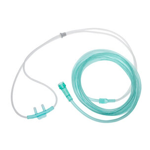
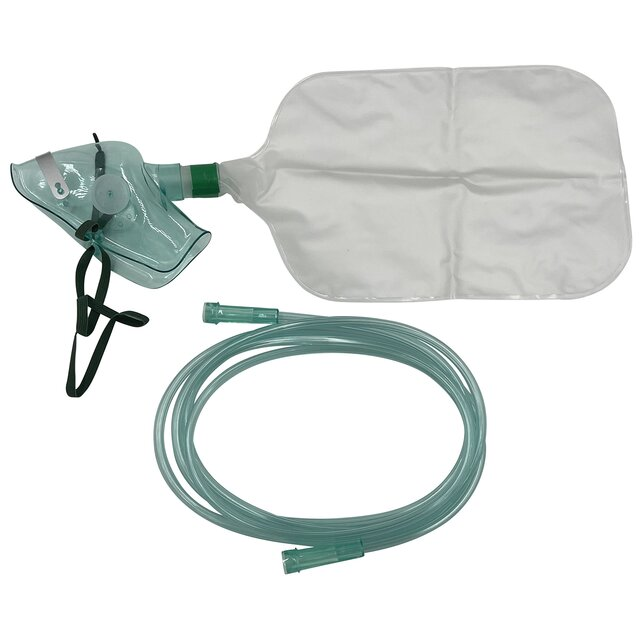
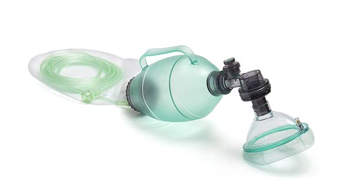
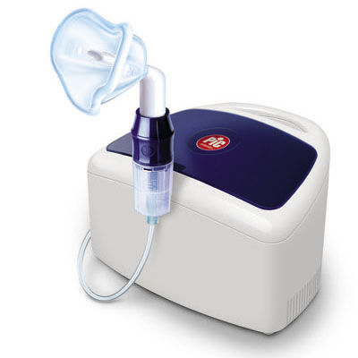
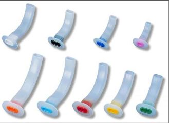
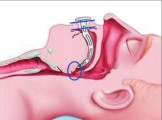
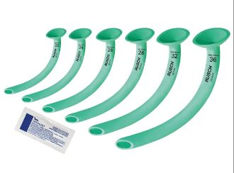
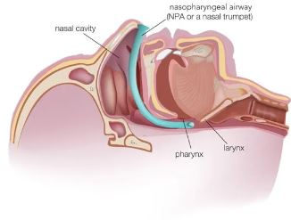
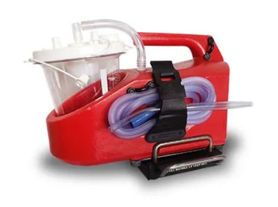

# Airway Management

This program will prepare you to perform more in depth airway management while on duty as a Basic Life Support Certified provider. It will go over oxygen delivery via OPA, NPA, BVM, NRB, Nasal Cannula, CPAP and BiPAP, nebulizer use and trauma management in the airway and pleural space.

## What is Airway Management?

The airway is the most important part of your primary assessment, and knowing how to manage it is critical as an EMS provider. The definition of Airway Management according to Ali Syed is “the assessment, planning, and series of medical procedures required to maintain or restore an individual’s ventilation, or breathing.”

Maintaining an open airway keeps the patient alive, prevents hypoxia and later death.

**Note:** When providing care to a patient that is unconscious you should remember to constantly verify their airways as a blockage could occur at any moment (vomiting, tongue falling back etc.)

## Airway Techniques

We use multiple different techniques to ensure the airway remains clear or ensure there is adequate airflow. These techniques are typically done on unconscious patients.
In the SAFD we use three techniques:
- **The recovery position** 
Ensures the airway doesn’t get blocked by the tongue
- **Jaw Thrust** 
Opens the airway
- **Head tilt** 
Opens the airway

These techniques ensure the airway remains clear and should be done every time you encounter a person unconscious.

## Nasal Cannula

Nasal Cannula should be used when a patient can breathe but may need some assistance in maintaining appropriate oxygen saturation.

The patient needs to be in stable condition to use this piece of equipment.

This breathing apparatus can be used by both Basic Life Support and Advanced Life Support Providers.

This breathing apparatus administers Oxygen through the Nasal Airway.

To start the administration of Oxygen, place the nasal cannulas up your patients nostrils and attach the Nasal Cannula tube to an Oxygen Tank. Turn on the Oxygen Tank and monitor your patients breathing. 

Flow Rates:
Can range from 1L/min to 4L/min

## Non Rebreather Mask (NRB)

Non Rebreather Mask should be used when a patient can breathe but can not keep a normal Oxygen Saturation. Commonly used for CO poisoning, airway limitation, physical trauma and smoke inhalation among others. 

This breathing apparatus can be used by any Basic Life Support Provider and any Advanced Life Support Provider.

This breathing apparatus provides Oxygen through the Oral and Nasal Airway. 

To start the administration of Oxygen through NRB you need to place the NRB over your patients nose and mouth and attach the NRB to an Oxygen Tank. Turn on the Oxygen Tank and monitor the patient's breathing.  

Flow Rates:
Can range from 0L/min to 15L/min

Note: Do not maintain 15L/min for extended periods of time to avoid over-oxygenation.

## Bag Valve Mask (BVM)

Bag Valve Mask should be used when a patient either cannot breathe or is breathing inadequately.

This breathing apparatus can be used by any Basic Life Support Provider and any Advanced Life Support Provider.

This breathing apparatus provides Oxygen through the Oral and Nasal Airway.   

To start the administration of Oxygen through a Bag Valve Mask you need to start by attaching the BVM tube to an Oxygen Tank and turning on the Tank, then monitoring the patient's breathing.

Note: You do not necessarily need to connect a BVM to an oxygen source to ventilate a patient. If an oxygen tank is unavailable you can still use the BVM to ventilate using the outside air.

Flow Rate:
15L/min

Note: Care for over-oxygenation

## Nebulizer

A nebuliser is a drug delivery device that is used to administer medication in the form a mist that is inhaled into the lungs.

Nebulisers are commonly used to deliver medication to treat asthma, cystic fibrosis, COPD and other respiratory disorders.

This piece of apparatus can be used by any Basic Life Support Provider and any Advanced Life Support Provider.

Method:
- Pour the medication into the medication cup.
- Attach the top piece and mouthpiece or mask.
- Connect the tubing from the compressor to the medication cup.
- Place the mask over your patient’s mouth or place the mouthpiece into your patient’s mouth.  
- Turn on the compressor.

## Oropharyngeal Airways and Nasopharyngeal Airways (OPAs and NPAs)

Oropharyngeal Airways and Nasopharyngeal Airways are small tubes used to maintain an open airway. Each has its own indications and contraindications so deciding which one to use is entirely relative to the situation. 

With NPAs and OPAs the size of the tubes matters, as using a size to big can damage the airways and a size to small can result in inadequate ventilation.

In the next two slides we will go over how to size and apply these Airway Management tools, along with their indications and contraindications.

## Oropharyngeal Airways (OPAs)

To start, an Oropharyngeal Airway should only be performed if the patient is unconscious and no longer has a gag reflex and has no physical obstruction in the airway. This is to prevent vomiting and gastric reflexes (gagging). 
Before performing an OPA you should first attempt to size the tube. To do this you should verify the gap between the maxillary incisors (front teeth) and the mandible group (jaw). 

Once you have the adequately sized OPA tube you can now insert it into the patient’s oral airway:
- Insert it by pointing the end towards the top of the mouth, and then twist it 180º to prevent further obstructing the airway with the tongue.
- Rest the flange on the patients lips and connect a Bag Valve Mask to the OPA via the valve. (refer to Bag Valve Mask (BVM))

## Nasopharyngeal Airways (NPAs)

To insert an NPA, you must first verify the nasal airway is clear of any obstructions and that the nose is not broken in anyway (as to not interfere if there is a septum nasal deviation). Along with this, there should not be any sign of Traumatic Brain Injury (TBI).
Similarly to the latter OPA, NPAs also need to be sized as to prevent damage to the airway or inadequate ventilation. The adequate size for an NPA is from the base of the tongue to just before the epiglottis (Around 1 cm above).

Once you have the adequately sized NPA tube you can now insert it into the patient’s nasal airway:
- Lubricate the NPA with a water-based lubricant
- Insert the NPA STRAIGHT DOWN into the patient’s nose. If resistance is felt remove the NPA and try the other nostril.
- The NPA has been fully inserted once the flange reaches the nostril.
- Rest the flange on the patient’s nose and connect a Bag Valve Mask to the NPA via the valve. (refer to Bag Valve Mask (BVM))

## Airway Suctioning

Airway Suction should be used in case there is a liquid airway obstruction preventing the patient from receiving adequate oxygen, which in turn can lead to hypoxia and death. Examples of usage is when there are secretions (vomit) and or blood in the airway, blocking the passage of air through the airway.

To perform airway suction:
- Insert a sterilized suction catheter into the patient airway;
- Begin suction at a pressure of no more than 200 mmHg for adults and between 80 mmHg and 120 mmHg in children and infants.
- Await 15 seconds and stop suctioning. Check airway and restart suction as needed.

Note: If there is blood in the airway, check for hemothorax.

## Smoke Inhalation

Airway burns and smoke inhalation are a reasonably common occurrence when working with structure fires, even among firefighters. The first priority when managing smoke inhalation victims is to maintain a high flow of oxygen, aiming for 100% SpO2.  
When a patient has inhaled a significant amount of smoke, they could suffer from Carbon Monoxide (CO) and or Hydrogen Cyanide (HCN) poisoning.  
To treat CO poisoning, you must maintain a high flow of oxygen and attempt to transport the patient to the nearest hospital with priority.  

## Mnemonics

**Airway Administration Devices**
- NPA - Nasopharyngeal Airway
- OPA - Oropharyngeal Airway
- BVM - Bag Valve Mask
- NRB - Non Rebreather (Mask)
- NC - Nasal Cannula
- CPAP - Continuous Positive Airway Pressure
- BiPAP - Bilevel Positive Airway Pressure
- PEEP - Positive-end Expiratory Pressure

**Airway Related Illnesses**
- COPD - Chronic obstructive pulmonary disease (group of diseases that cause airflow blockage and breathing-related problems)

**Common Terms**
- Auscultate - To listen (Generally to internal sounds in the heart or lungs)
- Supine - Lying face upwards
- Prone - Lying face downwards

