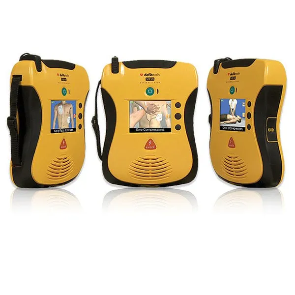
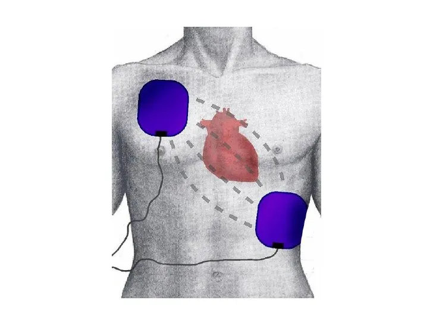

# Cardiology

The following program will teach you the basics of cardiology, including what induces heart attacks and cardiac arrest, as well as how to prevent the death of a patient suffering from a heart attack or chest pain.

## Chest pain

Chest pain can arise for a multitude of reasons, one of the major reasons being a heart attack. If you arrive on scene and the patient complains of chest pain, follow the usual patient assessment protocols for your specific patient.  
If the patient becomes unconscious, follow the cardiac arrest protocols outlined in the next section.

**Heart attack Management**
- Administer aspirin or nitroglycerin 
- Place AED pads on the patient’s chest in case of a sudden heart attack
- Administer oxygen as needed
- If the patient does not recover, request for ALS if available.

## Cardiopulmonary Resuscitation (CPR)

If someone becomes unconscious, your first job is to check their pulse. If you do not feel a pulse you should immediately begin chest compressions and have your partner or yourself request for an ALS unit to be routed to you. 

Chest compressions should be done at a rate of 30 compressions to 2 rescue breaths with a BVM or Bag Valve Mask.
If not already applied, apply AED pads to the patient.

An airway should be established as quickly as possible, preferably using an airway adjunct such as an NPA or OPA.
A LUCAS Device can be used to perform the compressions for you.

Return of spontaneous circulation or ROSC is a term used when a patient comes out of cardiac arrest. If this is to occur, place the patient in the recovery position and ALS interventions should be performed.

If the patient’s heart rate does not return after 15 minutes consult with a Paramedic or above for permission to call the death. Do not stop resuscitation efforts until given permission to do so. If none is available you can call the death yourself.

## Automatic External Defibrillator (AED)

An Automatic External Defibrillator is used to analyze a heart rhythm and, if necessary, deliver an electric shock or defibrillate the heart.  
If you want to apply AED pads you must first remove the patient’s upper torso clothing and, if necessary, shave the body hair around their chest and belly. You can then apply the pads to the patient’s bare chest and press analyze. Ensure nobody is touching the patient during analisis or shocking as it can give a bad reading or shock you too. 

After analyzing the monitor will then announce if shock is advised or not advised.  
If shock is advised, charge the monitor. Once it’s charged yell out clear and ensure nobody is touching the patient before shocking. Once the shock is administered, CPR can now be resumed and you repeat the above process until a pulse returns.

