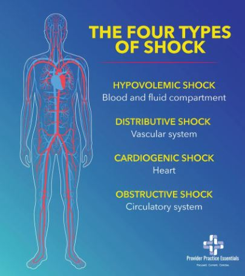

# Shock

The following program will go over the different kinds of shock, how they work and how to treat them.

## Different kinds of Shock

Shocks exist in many forms, but there are two major types of shock: Compensated Shock and Decompensated Shock. If a patient goes into decompensated shock their vitals will change rapidly and they will require immediate medical attention.  
Below are the different types of shock:
- Cardiogenic Shock: Heart can’t pump enough oxygen to the body.
- Hypovolemic Shock: Severe Blood Loss
- Anaphylactic Shock: Severe allergic reaction
- Neurogenic Shock: Damage to the nervous system

### How to manage a shock:
- High flow of oxygen
- Place in a supine position
- Keep warm, use a shock blanket
- Rapid transport

