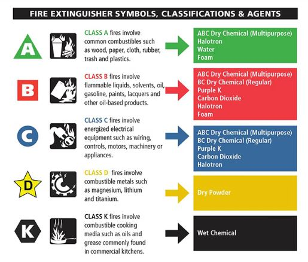

# Fire Theory

## Different kinds of Fire

There are a few different kinds of fire, each divided into a certain Class. In the image you can see the different kinds of Fire and how to deal with them.
How we deal with them at SAFD:
- Class A - Water
- Class B - Foam (medium to heavy)
- Class C - Water if power supply is cut off, otherwise Carbon Dioxide fire extinguishers.
- Class D - Dry powder Fire Extinguishers (L2/M28)
- Class K or F - Wet Chemical Extinguisher

 