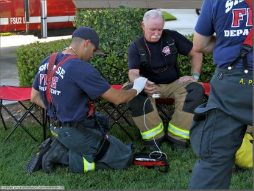

# Extras 

## Rehab

Rehabilitation, or Rehab for short, is a post similar to an incident command. They focus on the rehabilitation of firefighters after exiting a structure or after a tremendous physical effort. This will typically be done at the end of a fire, just before or after overhaul, or every 30 minutes if the fire is of extended duration. 

**Every firefighter is required to participate in rehab.**

In Rehab a firefighter’s vitals will be checked and ensure that they weren’t injured or suffered any medical issues during or after the operation.

