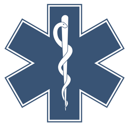

# Fireground and Radio Operations

## Scene Safety

When arriving on scene, especially as the first unit you must first determine if the area is safe for fire personnel to operate. Things you should look for are: 
- Is there anyone threatening or attempting to hurt fire personnel?
- Is there a risk of building collapse?
- Are there any signs of toxic chemicals that warrant a HazMat response?
- Is there a risk of electrical shock?

And so on.

If you encounter any of the above, advise scene command and request for pointers as to how to proceed.

## Building Sides

We divide buildings into multiple sides, division and sections to accurately pinpoint where the fire is as well as know where everything is going on.

Divisions describe the floors, (the ground floor being 1 and going up or down from there).

Sides are the sides of the buildings. Alpha is the front of the building and other sides follow from there in a clockwise motion.

Quadrants work similarly to sides but they go inwards, dividing the building into multiple parts.

## Scene Size Ups

Performing a scene size up is a critical aspect of firefighting. Without scene size ups scene command or other arriving units have no idea what’s going on until they actually arrive. Not only this, they may not spot certain things that can be pointed out during a scene size up, causing possible harm.

To perform a scene size up you must describe the following:
Order

\{Unit\} arriving on scene of a \{building description\} fire and smoke showing form the \{positions\} \{take scene command if appropriate\} \{if taking scene command, give orders\} 

**Example**

"Engine 2 on scene of a 2 story structure fire, fire and smoke showing from the alpha
bravo side, Engine 2 will be taking scene command. Engine 4 start primary attack, ladder 5 ventilation, rescue primary search, medic 22 prepare for rehab and triage."

## On the Fireground

When scene command has been established, the vicinity around a fire is now called a fire ground. There are some rules you need to follow when operating within a fire ground.
- Any orders given by scene command are to be followed. If you are told to perform an exterior attack (will be gone over later on), you must remain on exterior attack unless told otherwise.
- **DO NOT RUN ON THE FIREGROUND.**
- Always wear the appropriate PPE when on the fireground.
- Keep performing your assigned task unless told otherwise.

## Panics

If possible, Panic alarms or Mayday callouts are given when a firefighter has gone down or is trapped and can not escape. If you encounter yourself in this situation, you can use the NAMEIT mnemonic to let scene command know of where you are, who you are, what is wrong and what you need.

If not possible make sure pass alarm is on and press panic if you can.

- **N - Name**

	Your name and Rank
- **A - Apparatus**

	Your apparatus
- **M - Mission**

	What task or location were you assigned to prior to the event?
- **E - Emergency**

	What is the issue? Be specific.
- **I - Intentions**

	What can you do to help yourself?
- **T - Time**

	Estimate how long you have for rescue crews to come and aid you.

