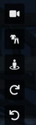

# Getting Started with KCDOJRP

Welcome to the Kelly County Department of Justice Roleplay community on FiveM! This section will guide you through the initial steps to get you started and immerse you in our role-playing experience.

🔍 This is a basic guide to get you started on the KCDOJRP server. For more detailed information and advanced features, please refer to the respective sections in the documentation.

---

## 💬 Discord Link Invite

Before anything, make sure to join our community on Discord to stay updated, get support, and interact with other members. Click [here](https://discord.gg/sAAMeZZvrq) to join our Discord server.

:::warning This is Required!

You must join our discord server to be able to play on the server.
:::

## 🚀 Joining the Server
Skip steps 1-4 if you are already familiar with FiveM. 

1. **Install FiveM**: Before you can join our server, ensure you have [FiveM](https://fivem.net/) installed. If you haven't, visit their official website and follow the installation instructions.
   
2. **Launch FiveM**: Once installed, launch FiveM and let it update to the latest version.

3. **Server Search**: In the FiveM client, click on the `Play` button and then on the `Servers` tab. Use the search bar to type "KCDOJRP" to find our server.

4. **Connect**: Select the KCDOJRP server from the search results and click `Connect`. You'll be loaded into our server shortly.

## 👤 Creating your first in-game character

Before doing anything, You must create a character to use while roleplaying!

1. Press the `F1` key, This will open the main menu which you can use to manage your in-game characters, spawn vehicles, and more!

2. Open `Civilian Dashboard` -> `Citizen Customization` -> `Create New Citizen`

3. This will open the character creation screen, From here you will be able to select the gender under `Ped`

4. Select `Inheritance` to customize parents race, face, etc

5. `Face Features` allows you to customize your characters head

6. `Appearance` allows you to customize your characters appearance.

7. Finish off with `Clothing`, `Props`, & `Tattoos`

8. **Saving**: Make sure to save your character by clicking the disk save icon 💾!

Tip: You can change you camera angles by using the following icons:

## 🖥️ Registering in the CAD

Now that we have created your character, We must register them into our [CAD(https://cad.kcdojrp.com/)](https://cad.kcdojrp.com/) system!

1. Open the [CAD(https://cad.kcdojrp.com/)](https://cad.kcdojrp.com/)

2. Select on `Login Via Discord` & select `Authorize`, If this is your first time logging in, Please enter a password you'd like to use
* The password will be used when accessing the CAD in game.

3. From here you can manage your characters, vehicles, LEO, and more!

4. Lets create our new character! Select on `Create Citizen`

5. Enter your characters name(Most people use their IRL name if its their main character), Date of birth, Gender, Race, Hair Color, Eye Color, Weight(in pounds), Height(in ft in, Ex. 5' 8"), and postal code(Will auto fill address). You can also upload an image of your character, However this is optional!
* Postal codes can be seen on the in-game map and are the 4 digit number.

6. Select Next, You can optionally fill in a phone number, occupation, and other info here!

7. Select Next, Here you can give your player license to do various things! Most players will only need a `Drivers License`, Select Valid, and `Non-commercial vehicles (Class D)
* You can also select invalid licenses and LEO will be able to see this on their side when they run your name!

8. Select Next, Here you can optionally put in any criminal history such as Tickets, Warnings, or Arrests! 

9. Select `Create`, Congrats! You have now created a new Citizen in the CAD! You will now be able to view all your information and play properly on the server!

# 🚗 Creating a vehicle

Now lets get you driving around the server!

1. Press the `F1` key, and go to `Vehicle Management Tools` -> `Vehicle Spawner` 

2. Here you will see all the categories of vehicles you can spawn, As you play on the server you may unlock more such as super cars, LEO, etc

3. Spawn a vehicle here and use the `Vehicle Management Tools` -> `Vehicle Management` to customize the vehicle to your liking.
* You can change the vehicle color, wheels, plate, and much more!

4. Once you have a vehicle created, Make sure to save it so you always have it! `Vehicle Management Tools` -> `Save Current Vehicle` enter the vehicles name.

5. Registering the vehicle in the CAD, Open the [CAD(https://cad.kcdojrp.com/)](https://cad.kcdojrp.com/) or use `F4` key in-game(Use your Discord username and the password we set earlier to login)

6. Select `Register Vehicle`, Optionally attach an image, Enter your plate, Model, Owner(You Characters name), Color, Trim levels(Optional), and status!

7. Select on `Register Vehicle`

### Congrats! You now have the basics of getting started on KCDOJRP! Next check out the [Commands](/docs/introduction/basic-commands) sections!