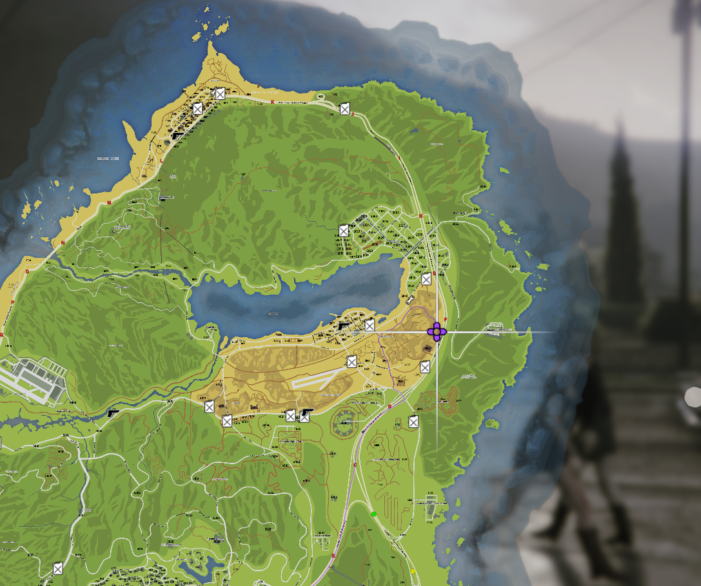

# LEO FTO | Guide & Procedures

**This guide is designed for Field Training Operators (FTOs) and Evaluators responsible for training cadets** in the respective departments. It outlines the procedures and expectations to ensure a consistent and thorough training process.

Recruits are to be respectful and obey all KCDOJRP rules during the training process. The instructor must abide by all the procedures laid out on this page.

---

Here are the following sections / testing phases

#### 1. [Application](#application)

#### 2. [CAD Registration](#cad-registration)

#### 3. [LEO Menu Introduction](#leo-menu-introduction)

#### 4. [10 Codes, David Codes, & Call-signs](/docs/leo/information/codes)

#### 5. [Driving Test](#driving-test)

#### 6. [Weapon Training](#weapon-training)

#### 7. [Traffic Stop](#traffic-stop)

#### 8. [Vehicle Pursuit](#vehicle-pursuit)

#### 9. [Felony Traffic Stop](#felony-traffic-stop)

#### 10. [Foot Pursuit](#foot-pursuit)

#### 11. [Jailing & Reports](#jailing--reports)

---

## Application
Before a recruit is able to go through the training phase every recruit must submit and have their application accepted [LEO Application](https://docs.kcdojrp.com/application/bcso).
Once an application is submitted it will be reviewed by the department heads and the KCRP staff team. Once accepted the recruit will be given the probationary roles.

## CAD Registration
Every recruit must be registered in the [CAD](https://cad.kcdojrp.com/officer).
Once registered, the recruit will create an officer [here](https://cad.kcdojrp.com/officer/my-officers).

From here open a ticket on the Discord for the user to be accepted into the CAD. You can move on while you wait for this to be accepted. **Come back to this once accepted and show the recruit how to manage their unit, create/run calls, and write reports.**

## LEO Menu Introduction
Lead the recruit through the following options in the in-game LEO menu.
- Actions:
    - Dragging a player.
    - Cuffing a player.
    - Placing a player into a vehicle.
    - Deploying and operating spike strips.
    - Checking BAC of a player.
- Speed Zones:
    - Creating and removing speed zones.
- Wardrobe
    -  Uniforms and their use cases.
- Vehicles
    - Probationary deputies will only be permitted to use the first 3 vehicles in the list.

## [10 Codes, David Codes, & Call-signs](/docs/leo/information/codes)
Review the [Radio Callsigns, Codes, and Alphabet](/docs/leo/information/codes) page.
Review the [Directory](/docs/leo/information/directory) page.

## Driving Test
Start at Fort Zancudo with a LEO vehicle and run through various areas of the base, setup a cone course, and more.
Once you have completed this, have the recruit drive around the map to various locations by name/memory.
This section will also test the knowledge of the GTA V map.

## Weapon Training
You and your recruit should head to the shooting range north of the "U-Tool."

## Traffic Stop
1. Return to Fort Zancudo for traffic stop training.
2. An instructor or helper should speed past the recruit.
3. The recruit initiates a traffic stop on the speeding vehicle using radar (F5).
4. The recruit should position their car at an angle, half a car length away from the stopped vehicle.
5. Use proper radio communication to contact dispatch and report the traffic stop (instructor acts as dispatch).
6. Avoid standing between the two vehicles when approaching.
7. Make professional contact with the driver, gather their information, and run it in the CAD.
8. Give a verbal warning in this scenario.

## Vehicle Pursuit
Now we will have the same scenario except the vehicle will fail to yield to the recruit.
The recruit should follow all traffic laws and safely chase the fleeing vehicle.
After some time, the vehicle should stop, and you will move on to the next section.

## Felony Traffic Stop
The recruit will execute a felony (A.K.A. Code 5) traffic stop on the fleeing vehicle from the previous phase.

## Foot Pursuit
The fleeing vehicle's individual will now run from the officer.
Here it will be at the recruits discretion on how to approach the situation.
Lethal force will not be authorized during this training!
Show the recruit the tackle function: (Shift+Forward+E) while looking at the player.
The recruit should successfully apprehend the fleeing suspect while abiding by all policies and rules.

## Jailing & Reports
Now, have the recruit fill out a report in the CAD, run all the information, file the arrest report and charges, and transport the suspect to the Sandy Shores jail.

---

## **Final Notes:**
- A recruit is allowed *3 minor mistakes per phase* and only *3 major mistakes* throughout the entire process, or *1 critical mistake*.
- Failing this process requires the recruit to review the documentation and restart the training.
- Multiple failures necessitate resubmission of the initial application.

---