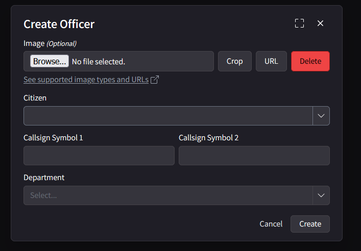

# LEO FTO | Guide & Procedures (WIP)

**This guide is designed for Field Training Officers (FTOs) and Evaluators responsible for training cadets**. This document outlines the procedures and expectations to ensure a consistent and thorough training process across all law enforcement officers.

Recruits are to be respectful and obey all KCDOJRP rules during the training process. The instructor must abide by all the procedures laid out on this page.

---

## Training Sections

1. [Application & Review]
2. [Discord Roles]
3. [CAD Registration & On-duty]
4. [CAD Usage & Penal Codes]
5. [LEO Menu & LEO Commands]
6. [Radio Usage & Radios Codes]
7. [Driving Tests]
8. [Standard Traffic Stop & Tickets]
9. [Vehicle Pursuits]
10. [Felony Traffic Stop & Foot Pursuit]
11. [Jailing & Reports]
12. [Questions & Final Evaluation]

--

## Application & Review

A recruit will submit an application [here](https://docs.kcdojrp.com/docs/leo/apply#application-process), Upon submission of the application a ticket will be opened in the Discord server with the application. We will review the applicant application in the private thread attached.

Once reviewed and accepted, We will move forward with the FTO process.

## Discord Roles

Upon acceptance before training we will grant the department specific role along with the department recruit role to the member.
This will grant the recruit all the permissions in the CAD and in-game.

Then post in the [#roster-updates](https://discord.com/channels/1132847710282727565/1270093499110395944) the updated positions!

## CAD Registration

The recruit will likely need to fully logout of the [CAD](https://cad.kcdojrp.com) and re-login via Discord to gain access to the new permissions.

If the recruit doesn't already have a citizen in the CAD they will need to [create one.](https://docs.kcdojrp.com/docs/cad/citizens)

Next, Head over to the "Officer" tab and then "[My Officers](https://cad.kcdojrp.com/officer/my-officers)". Select "Create Officer" select the citizen, and give the call sign based off the [roster](https://docs.kcdojrp.com/docs/leo/information/directory).

From here, Have the recruit go 10-6 for the first time on the Officer Dashboard!

## CAD Usage & Penal Code

Once the recruit is 10-6 go over all the various 10 status codes with them.
- 10-8 - Clear & Available
- 10-49 - En-route
- 10-97 - On Scene/In the area
- 10-6 - Busy with official business
- 10-7 - Busy with un-official business (Commonly AFK for a couple minutes)
- 10-10 - Off Duty
- 10-33 - Panic Button

Next head over the various buttons and their operations in the CAD;
Name Search (Search "John Doe"), Plate Search (Search "12ABC34"), Create Call (CFS = Call For Service), Create Written Warning, Create Bolo, Notepad, and the various sections below.

*Warrants can only be issued byu Supervisors, The Recruits will not be able to.

10-29/29 = Bolo's & Warrants

## LEO Menu & Commands

Next you'cll show the recruit through the in-game LEO menu and command!

Guide the recruit through the in-game LEO menu, covering the following functions:
- **Actions:**
  - Dragging a player.
  - Cuffing a player.
  - Placing a player into a vehicle.
  - Deploying and operating spike strips.
  - Checking BAC of a player.
  - Tackling a player(Shift+W+E)
- **Speed Zones:**
  - Creating and removing speed zones.
- **Wardrobe:**
  - Uniforms and their appropriate use.
- **Vehicles:**
  - Probationary deputies are restricted to the first three vehicles on the list.

Also review the commands for all of the actions additionally basic commands such as `/cuff`, `/drag`, `/piv`, `/spikes {num}`, `/dv`, etc. And their keybinds.

The wardrobe will automatically assign the correct uniforms based on the players rank.

Lastly, Go over the tackling system with the recruit which is "E" while running towards a player.

## Radio Usage

Teach the recruit how to access and operate the radio:

- **Command:** `/radio`
- **Channel:** `155 MHZ`

Ensure the recruit is comfortable with radio communication before moving on to the next phase.

## [10 Codes, David Codes, & Call-signs](/docs/leo/information/codes)
Review the [Radio Callsigns, Codes, and Alphabet](/docs/leo/information/codes) with the recruit. Ensure they understand the standard communication codes used in the department.

Additionally, review the [Directory](/docs/leo/information/directory) for a better understanding of departmental structure and their colleges.

You should also go over basic procedures and terminology at this points, For Ex. What is a Felony Traffic Stop (Code 5).

## Driving Test

Conduct the driving test starting at Fort Zancudo:

1. Use a LEO vehicle to navigate various areas within the base.
2. Set up a cone course to test basic maneuvering.
3. Once the base course is completed, have the recruit drive to various named locations around the map from memory.

This phase also tests the recruit's knowledge of the GTA V map.

## Standard Traffic Stop

* The training officer should be using a brightly colored ford explorer of the department in training for with the plate "12ABC34" and name "John Doe"
* The recruit should be using a standard LEO vehicle for the department in training for.

1. Return to Fort Zancudo for traffic stop training.
2. An instructor or helper will simulate a speeding vehicle for the recruit to stop.
3. The recruit initiates a traffic stop and properly clocks the speeding vehicle using radar (F5).
4. Positioning: The recruit should angle their vehicle, leaving half a car length from the stopped vehicle.
5. Proper radio communication must be used to contact dispatch (instructor acts as dispatch).
6. Approach the vehicle safely, avoiding standing between the vehicles.
7. The recruit should professionally engage with the driver, gather necessary information, and run it in the CAD.
8. Issue a verbal warning in this scenario.

* The training officer is not to be combative or aggressive during the traffic stop.
* The recruit will make radio calls as outlined in [LEO First Shift](/docs/leo/information/first-shift#wo-dispatch) (Without Dispatch)

## Vehicle Pursuit

Simulate a scenario where the speeding vehicle fails to yield:

1. The recruit should engage in a pursuit, following all traffic laws and maintaining personal and public safety.
2. After a reasonable period, the vehicle will stop, moving into the next phase.

## Felony Traffic Stop

The recruit will conduct a felony (Code 5) traffic stop on the previously fleeing vehicle:

1. Utilize proper procedures to ensure officer safety.
2. The recruit should communicate effectively and control the scene.

## Foot Pursuit

Simulate a foot pursuit:

1. The suspect will flee on foot after stopping the vehicle and attempting a felony stop.
2. The recruit must decide on the appropriate course of action, following KCRP policies.
3. Demonstrate the tackle function: (Shift + Forward + E) when close to the suspect.
4. The recruit should successfully apprehend the suspect, adhering to all rules and procedures.

**Note:** Lethal force is not authorized during this training phase.

## Jailing & Reports

Instruct the recruit to:

1. Complete an accurate and truthful arrest report in the CAD.
2. Process the suspect, including filing charges and transporting them to the Sandy Shores jail.

## Evaluation

At the end of the training, evaluate the recruit based on their performance across all phases:

- A recruit is allowed *3 minor mistakes per phase* and only *3 major mistakes* throughout the entire process, or *1 critical mistake*.
- Failing this process requires the recruit to review the documentation and restart the training.
- Multiple failures necessitate resubmission of the initial application.

Based on this evaluation three things can happen.
1. The recruit will be prompted to a standard LEO and be permitted to patrol on their own.
- This is reserve for nearly perfect passes on this training.
2. The recruit will have passed the training with some mistakes.
- The recruit will be required to patrol with a full LEO until promoted by a supervisor.
3. The recruit failed the training.
- If a recruit has failed this training phase they will be notified and roles/access will be revoked. The recruit must wait 2 weeks to re-apply and will be asked to study the documentation before re-applying.

---

## Final Notes

- Ensure recruits are respectful and follow all KCRP rules during training.
- FTOs must adhere to these procedures to maintain training consistency.
- After successful training, recruits are ready for active duty under probation.

---
