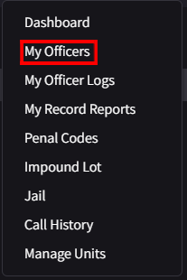
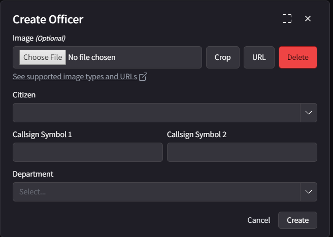

# LEO CAD

This is a guide to help you access and setup the LEO portion of the CAD!

1. First, go to the Officer tab at the top of the cad, like below!

   
   * Note: Make sure to create a citizen without a record, and make sure you have the proper discord roles!

2. Go to the drop down of the Officers Tab, and go to My Officers.

   

3. You will then go to create officer in the right hand side of the CAD.

4. When creating an officer, make sure to use the callsign and department that the recruiter gives you in your ticket. An example is below!

     

5. In the example above, the 1st part of the callsign is 2N and the 2nd part is 30 and the department is Blaine County Sheriff. It is important that you put the accurate information in. You may put an imnage if you wish.
