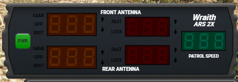

# LEO Menu

This guide will lead you though the basics of how to setup your radar while on patrol!

1. Press `F5` while in a patrol vehicle to open the radar remote!

* Note, You must be in a police vehicle to open the radar remote!

2. Now click on `Toggle Display` to show the radar on your screen

3. You can click and drag the radar on your screen to position it where you would like it and click on `UI Settings` on the remote to configure the size.

4. Click the green `PWR`(Power) button on the radar to turn it on

5. Remote Configuration

The top 3 buttons in a row are for your front antenna, lower 3 are for rear antenna.
Opp means the opposite lane of traffic area will be targeted(angle)
Same means directly upfront or behind the patrol vehicle.
XMT/HOLD means Transmit and Hold, This simply turns off your radar.

When you first enable the radar the suggest configuration is as follow:
- Disable XMT/Hold on bothy front and rear.
- Opp for front
- Same for rear

6. Vehicle speeds will be shown on the radar screen.

7. Next we should configure the fast lock, This will lock plates and speed over a specified speed.

- In the remote click `MENU` and find `FAS Loc` and make sure its `On`, Select the up or down arrow to change the option.
- Now find `FAS SPd` in the settings, and use the up or down arrow to change the set speed to lock. Its suggest to use 75 or 80.