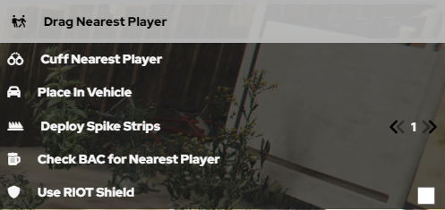

# LEO Menu

This is a guide on how to use the LEO Menu in KCRP! This guide will show you how to cuff, drag, use and deploy spike strips, and create speedzones around an area.

We wil start off with the most important part of the menu: LEO Actions.

1. First up is Drag Nearest Player. It is used to drag suspects or officers around. You can drag someone who is cuffed or not cuffed. You can press Drag Player, do /drag in chat or you can keybind it in settings by going to Settings> Keybinds> Fivem> (KC-MENU) Drag Nearest Player. It's important that you have people get away from you before doing this, as this can result in you accidently dragging someone else by mistake instead of your intended target.

2. Next up is Cuff Nearest Player. This is used to cuff suspects when arresting them. You can press Cuff Nearest Player, do /cuff in chat, or you can keybind it in settings by going to Settings> Keybinds> Fivem> (KC-MENU) Cuff Nearest Player. It is important that you ask other players to step away from you so you do not cuff another player instead of cuffing your target. It is also important to note that players can run in cuffs, so be careful to drag the player you cuffed if you are intending to arrest or detain them.

3. Next is Place in Vehicle. This allows you to place players who are dragged in to the back of your vehicle. You can press Place in Vehicle, do /piv in chat, or you can keybind it in settings by going to Settings> Keybinds> Fivem> (KC-MENU) Place in Vehicle. It is important to note by default all LEO back doors are locked, so the back passenger is unable to get out of the vehicle on their own unless you disable it in Vehicle Management.

4. Next is Deploy Spike Strips. You can deploy up to 5 spike strips. You can do this by clicking Deploy Spike Strips with your desired number. or you can do /spikes 1-5. It is important to note spike strips impact both Player and AI Vehicles, so you do need to be quick about picking them up. To Pick up Spike Strips, you can do /spikes or press Deploy Spike Strips and they will retract and despawn.

5. Next is Check BAC for nearest Player. This will allow you to check a BAC of a player, but not every player does this, so its important to do /me checks bac just in case. The notification appears just over the top of your minimap, so make sure to keep an eye on it if you do this.

6. The last part of the LEO Menu is riot shield. This allows you to equip a bullet proof riot shield along with a pistol. This shield is actually bullet proof and will protect you from bullets, but its important to crouch, otherwise it will not protect your legs!

