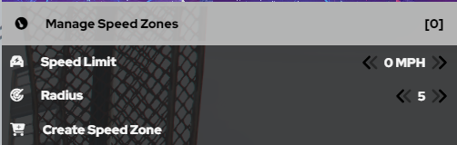

# LEO Menu

This is a guide on how to use the LEO Menu in KCRP! This guide will show you how to cuff, drag, use and deploy spike strips, and create speedzones around an area.

We wil start off with the most important part of the menu: LEO Actions. This is what you will use a majority of the time you are on patrol!

1. First up is Drag Nearest Player. It is used to drag suspects or officers around. You can drag someone who is cuffed or not cuffed. You can press Drag Player, do /drag in chat or you can keybind it in settings by going to Settings> Keybinds> Fivem> (KC-MENU) Drag Nearest Player. It's important that you have people get away from you before doing this, as this can result in you accidently dragging someone else by mistake instead of your intended target.

2. Next up is Cuff Nearest Player. This is used to cuff suspects when arresting them. You can press Cuff Nearest Player, do /cuff in chat, or you can keybind it in settings by going to Settings> Keybinds> Fivem> (KC-MENU) Cuff Nearest Player. It is important that you ask other players to step away from you so you do not cuff another player instead of cuffing your target. It is also important to note that players can run in cuffs, so be careful to drag the player you cuffed if you are intending to arrest or detain them.

3. Next is Place in Vehicle. This allows you to place players who are dragged in to the back of your vehicle. You can press Place in Vehicle, do /piv in chat, or you can keybind it in settings by going to Settings> Keybinds> Fivem> (KC-MENU) Place in Vehicle. It is important to note by default all LEO back doors are locked, so the back passenger is unable to get out of the vehicle on their own unless you disable it in Vehicle Management.

4. Next is Deploy Spike Strips. You can deploy up to 5 spike strips. You can do this by clicking Deploy Spike Strips with your desired number. or you can do /spikes 1-5. It is important to note spike strips impact both Player and AI Vehicles, so you do need to be quick about picking them up. To Pick up Spike Strips, you can do /spikes or press Deploy Spike Strips and they will retract and despawn.

5. Next is Check BAC for nearest Player. This will allow you to check a BAC of a player, but not every player does this, so its important to do /me checks bac just in case. The notification appears just over the top of your minimap, so make sure to keep an eye on it if you do this.

6. The last part of the LEO Menu is riot shield. This allows you to equip a bullet proof riot shield along with a pistol. This shield is actually bullet proof and will protect you from bullets, but its important to crouch, otherwise it will not protect your legs!

Next up is Speedzones, This is useful for Traffic Stops, Car Crashes, and anything else you may need them for!

1. First up is manage speedzones. This allows you to see all speedzones around the map and to delete them when they are no longer needed. Avoid deleting the ones you didnt create unless you know they are no longer needed.

2. Speed Limit allows you to set a speed limit of how fast you want AI to move in your speed zone. This is useful if AI get spooked or a gun gets pulled out. Its helpful to keep the limit at zero, so they cant accidentally run you over. Note: This will not affect Players in any way. They can drive around the AI.

3. The Radius Option allows you to set as big as a radius you want to stop AI from moving, but it is important to keep it as small as possible so that it doesnt interrupt traffic as much.

4. Last is Create Speed Zone. After setting your Speed Limit, and setting your radius, you can hit this to make your speed zones. 

Next is K9, Which you always need to use with another officer, and you need to be K9 Certified before using it. 

1. To become a K9 Dog, just press K9. Afterwhich, you have various emotes you can do such as Bark, Sit, Taunt Etc. You can also change your variation based on your department. To exit K9 mode, just hit Exit K9 Mode at the top of the section

Next is the Wardrobe, where you can find all of your preset uniforms for your department. Along with getting your uniform, this is also how you get your approved loadout. 

1. When selecting which uniform to use, it is important to note any subdivision uniforms you may or may not see are for subdivisions only and should not be worn by people not in those subdivisons

2. All Uniforms are rank locked to specific ranks, meaning only certain ranks can wear certain shirts, or have certain chevrons or collar bars. This is to ensure Supervisors and Command can be easily identified.

   Next is LEO Vehicles. Based on Department, it may say Sheriff Vehicles, Police Vehicles, Trooper/Highway Vehicles or Fire Vehicles. This is where you can find all your departments vehicles. Based on your departments policy, you may be prohibited from driving certain vehicles. It is important to note for Supervisors, Supervisor liveries are automatically applied to vehicles when spawned if you have the proper Supervisor rank.

  1. All Vehicles can be saved for later use, unless you are prohibted from your departments policies from doing so.

  2. Make sure you are logged into cad before spawning your patrol vehicle, because CAD automatically sets your plate as your callsign. 

