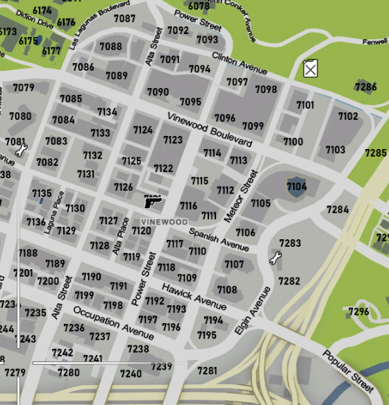
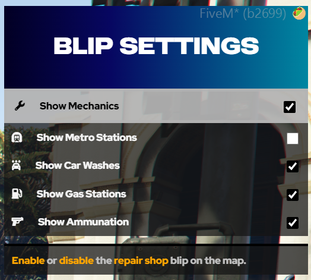

# What are Postal Codes?

Postal codes are 4-digit identifiers for basically every possible location on the map that isn't a road. Looking for the Vinewood P.D.? The postal would be 7104 (as seen in the screenshot below)!

These postal codes will display both on the big main map, as well as the small mini-map in the bottom left corner of your screen.

### Custom Locations

Some custom areas of interest will also have their own icons. For example, the mechanic shop at postal 7203 has a wrench icon. This is all customizable via our custom Kelly Menu (the F1 menu) within `Miscallaneous Options` -> `Blip Settings`.

### The Postal Command

You also have the ability to use the `/postal [code]` command in-game.
This command allows you to enter one of the postal codes and it will draw a route on your mini-map to the location, like so:

